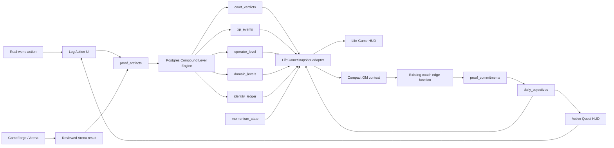

# Eblocki Life-Game Integration Master Plan v1

Status: release-candidate implementation on `codex/life-game-v1`; dashboard promotion blocked
Repository: `tristanxsinclair/www.eblocki.space`
Starting point: `origin/main@42064441b5e5ce9bac0daec69239edd1535ded32`
Implementation date: 2026-07-25
Schema impact: none
Release-order dependency: `WP-005A / P1-PAY-ENV VERIFICATION` remains the next strict release gate

## 1. Decision

Eblocki is becoming:

> A life game where real actions only count when evidence exists.

This is a presentation and orchestration layer over the existing Behavioural Evidence Operating
System. It is not a second game engine and does not replace proof, Court, Temporal, Sentinel,
Cortex-ready analysis, or the Compound Level Engine.

The remodel is intentionally ambitious at the experience layer and conservative at the truth
layer:

- quests are projections of `daily_objectives` and `proof_commitments`;
- actions are user-facing projections of `proof_artifacts`;
- character XP comes only from `xp_events`;
- verdicts come only from `court_verdicts`;
- character and stat levels project `operator_level` and `domain_levels`;
- streak and consistency state project `momentum_state`;
- the Run Log begins with proof rows so delayed secondary records cannot hide an action;
- the Game Master is the user-facing identity of the existing `coach` function;
- Arena is the user-facing identity of GameForge;
- existing internal names and persistence contracts remain stable.

No artifact means no progress claim. A plan, feeling, checkbox, generated response, or Arena score
cannot manufacture character progress.

## 2. Repository truth and release boundary

Implementation began from a fresh Git worktree, not the stale desktop root or the obsolete July 8
Snapdragon branch. The fetched remote SHA remained
`42064441b5e5ce9bac0daec69239edd1535ded32`.

Confirmed constraints:

- React 18, Vite, TypeScript, React Router, Tailwind/shadcn, Supabase, PostHog-compatible analytics,
  Capacitor, and Lovable metadata remain the product stack.
- This is not Next.js. No App Router or Next.js files are authorized.
- The repository does not contain `LegacyPanelRedirect`; none was invented.
- The repository has no `LICENSE` file. Marketing and metadata do not claim MIT or open-source
  status.
- Generated Supabase types and historical migrations are unchanged.
- Phase 1 introduces no table, column, function, trigger, RLS policy, or GRANT.
- Product-code work is implemented as a release candidate, but `/dashboard` promotion is not
  authorized by local compilation alone.
- `WP-005A / P1-PAY-ENV VERIFICATION` remains an explicit release-order dependency.

## 3. Product doctrine

The primary loop is:

1. Receive or choose one quest.
2. Perform the action in real life.
3. Log the action and attach evidence.
4. Let the authoritative evidence system write its verdict and XP.
5. Update character level, projected stats, momentum, and Run Log.
6. Receive one next quest from the Game Master.

Truth rules:

- No artifact means no XP.
- A proof-required quest cannot complete through swipe, hold, checkbox, or reflection text alone.
- AI cannot award XP, invent a verdict, mark completion, or raise a level.
- Arena Score is practice feedback, not character XP.
- Weak evidence can protect momentum only where existing rules allow it; UI copy cannot promote it
  to strong or elite evidence.
- Missing secondary records are `sync pending` or `unavailable`.
- A failed objective or commitment sync never deletes a valid artifact.
- Retrying sync must not create a second artifact.
- Historical users render through adapters without backfill.

## 4. Canonical terminology

Terminology is contextual. Internal schema, legal text, release evidence, and advanced evidence
explanations retain precise proof language.

| Game-facing term | Trusted meaning | Existing source |
| --- | --- | --- |
| Action | User-produced proof artifact | `proof_artifacts` |
| Evidence | Material supporting the action | artifact metadata, content, attachment |
| Quest | Daily objective or durable commitment | `daily_objectives`, `proof_commitments` |
| Game Master / GM | Coach presentation and persona | `/coach`, `supabase/functions/coach` |
| Character | Overall operator identity | `operator_level` |
| Stat | Cosmetic projection of domain progress | `domain_levels` |
| XP | Committed Compound Level Engine output | `xp_events` |
| Verdict | Court judgment | `court_verdicts` |
| Run Log | Actions plus meaningful ledger events | proof, XP, verdict, identity ledger |
| Arena | Playable practice engine | `src/lib/gameforge/*` |
| Intel | Existing advanced analysis | Dashboard, Temporal, audit, Sentinel/Cortex-ready surfaces |

Primary game copy:

- `Log Action`
- `Evidence required`
- `Quest locked`
- `Verdict protocol`
- `XP pending verification`
- `Filed to Run Log`
- `Open Intel`
- `Enter Arena`
- `NO ARTIFACT // NO XP`

Advanced disclosures may continue to use `proof artifact`, `proof standard`, `Proof Contract`, and
`Court of Evidence`.

## 5. Authoritative architecture



Authority matrix:

| Concern | Authority | Client permission |
| --- | --- | --- |
| Artifact creation | existing Proof/Arena insertion path | may insert owned artifact |
| Court verdict | Postgres trigger/output | read only |
| Character XP | `xp_events` | read only |
| Operator/domain level | level tables | read only |
| Quest recommendation | deterministic Coach route plus optional remote enhancement | may create one commitment |
| Quest completion | objective linked to an existing artifact | may close owned objective |
| Stat grouping | presentation adapter | display only |
| Arena score | GameForge session | practice display only |
| Demo | local deterministic fixture | no Supabase or remote AI |

## 6. Presentation contracts

The canonical contracts live under `src/lib/eblocki/life-game/`.

`LifeGameSnapshot` contains:

- authoritative operator level, title, rank, total XP, in-level XP, and threshold;
- five cosmetic `LifeStatProjection` rows;
- one active quest and a queue;
- momentum/streak state when available;
- five Run Log entries built from action rows plus level-up ledger signals;
- recent Game Master input previews;
- per-query health states: `ok`, `empty`, or `error`.

The adapter imports generated `Tables<>` types through narrow `Pick<>` projections. It does not edit
the generated file and does not use `any` to coerce the view model.

### 6.1 Stat projection

Mapping:

- Body ← soccer
- Mind ← law, psychology
- Craft ← sales, finance, eblocki
- Social ← life
- Discipline ← operator level

For each domain:

```text
fractional level =
  safe level + clamp(safe xp_in_level / levelThreshold(level), 0, 0.999)
```

Grouped stats average only rows that exist. No existing row means Level 1 at 0%. Discipline uses
authoritative operator progress directly. Momentum and streak remain adjacent signals and do not
rewrite accumulated Discipline.

Every stat is marked `isProjection: true`. UI tooltips and labels list contributing domains.

### 6.2 Quest precedence

Selection order:

1. today’s active objective;
2. today’s first pending objective by position;
3. newest pending commitment not already represented by an objective;
4. an honest no-quest state.

Quest links are constructed only from UUID-shaped IDs:

```text
/proof?source=quest&contract=<commitment-id>&objective=<objective-id>
```

URL IDs are hints. `/proof` resolves the objective by `id + authenticated user_id`; contract hints
can resolve only against the authenticated user’s fetched pending rows. URL text never prefills
trusted evidence content.

### 6.3 Quest closure transaction

Required order:

```text
artifact insert succeeds
→ linked commitment closes
→ linked objective receives proof_artifact_id
→ objective becomes completed
→ HUD refreshes
```

The artifact is the durable success boundary. If a later sync fails:

```text
Action logged // quest sync pending
```

The HUD performs a narrow idempotent repair when an open objective references a commitment that
already contains `proof_artifact_id`. Repair updates only the owned objective. It cannot create
evidence or XP.

### 6.4 Run Log

Base rows: `proof_artifacts`.

Secondary joins:

- latest `court_verdicts` row by `proof_id`;
- latest `xp_events` row by `proof_id`;
- relevant `identity_ledger` escalation rows by `proof_id`.

The default HUD fetch excludes artifact content, attachment names, paths, URLs, OCR text, feedback,
and next-upgrade bodies. Duplicate secondary records select the newest row and never sum XP.

Sync state:

- `complete`: both verdict and XP exist;
- `pending`: proof exists and a secondary record is absent;
- `unavailable`: the corresponding query failed.

## 7. Experience

### 7.1 Visual system

The implementation retains current semantic tokens and typography. No font dependency was added.

Scoped utilities:

- `.life-game-shell`
- `.crt-surface`
- `.scanlines`
- `.hud-grid`
- `.life-game-boot`

Scanlines are fixed, extremely subtle, and `pointer-events: none`. Reduced-motion preferences
disable boot-line animation. The boot panel runs once per browser session and derives status from
real query health; a failed slice says `DEGRADED`, never `ONLINE`.

### 7.2 Landing

The study-only hero is replaced with:

```text
> BOOTING EBLOCKI ...
YOUR LIFE. TURNED INTO A GAME.
REAL ACTIONS ONLY COUNT WITH EVIDENCE.
```

The page explains the five-stage loop, previews a fictional character, active quest, GM callout,
and Run Log, and exposes:

- Start your run
- Play the demo
- View how XP works

Metadata and README positioning match the life-game identity. No unsupported license claim exists.

### 7.3 Public demo

`/demo` is public and read-only:

- prominent `DEMO OPERATOR // SAMPLE DATA`;
- deterministic fixture with injected clock;
- no Supabase imports in the page or fixture;
- no Coach function call;
- no shared anonymous account;
- no user text sent to analytics or external APIs;
- canned GM output labelled `DEMO SCRIPT`;
- action paths convert to auth;
- no Tristan history, email, names, attachment data, or production identifiers.

### 7.4 Protected HUD

`/game` is mounted through the existing `Protected` wrapper. `/dashboard` remains unchanged.

Desktop:

- operator header, XP, streak, actions today, connection state;
- left stat rail;
- central active quest and Log Action;
- right Game Master channel and Arena entry;
- bottom Run Log;
- Intel disclosure.

Mobile order:

1. operator header;
2. active quest;
3. Log Action;
4. verdict/XP sync state;
5. projected stats;
6. Game Master;
7. Run Log;
8. Intel.

The HUD does not put raw AI output, artifact bodies, markdown walls, or Temporal tables above the
quest.

### 7.5 Navigation and compatibility

Canonical routes remain:

- `/proof`
- `/coach`
- `/gameforge`
- `/operator`
- `/sheet`
- `/proof-week`
- `/modes`
- `/start-today`
- `/dashboard`

Aliases:

- `/log` → Proof component
- `/gm` → Coach component
- `/arena` → GameForge component
- `/character` → Operator component

The aliases are mounted through the same protected components; no duplicate pages or persistence
systems exist.

Primary desktop labels are Today, Log Action, Quests, Game Master, Arena, Character, Intel, and
Settings. Mobile labels are Today, Log, GM, and More.

Because authenticated `/game` QA is not yet proved, primary Today still points to `/dashboard`.

## 8. Game Master

Internal stability:

- function directory remains `supabase/functions/coach`;
- route remains `/coach`;
- request and normalized response shapes remain compatible;
- proof commitment creation remains the existing behavior;
- vector retrieval remains fail-soft;
- crisis/safety boundaries are not removed.

User-facing identity: Game Master.

Allowed:

- diagnose avoidance;
- issue one quest;
- identify one required artifact and evidence standard;
- explain an existing authoritative verdict;
- recommend Arena practice;
- call out repetition or self-deception;
- name one next controllable action.

Forbidden:

- award XP;
- invent a verdict or completion;
- mark an action as performed from user description;
- call estimated XP awarded XP;
- override deterministic routing;
- fabricate legal, academic, or scientific sources;
- moralize or diagnose mental health;
- create competing quests.

The optional remote prompt receives compact authenticated context:

- operator level/rank/title and XP metadata;
- domain level metadata;
- latest momentum/streak;
- last five artifact metadata rows, excluding raw content;
- matching authoritative XP and verdict rows;
- pending commitments;
- active mode IDs.

It does not receive attachment URLs, paths, OCR text, full evidence bodies, secrets, or unrelated
history. If context retrieval fails, the prompt says context is unavailable and forbids inference.

When AI is unavailable, the existing deterministic route returns a structured:

```text
CALLOUT
QUEST
ARTIFACT
STANDARD
NEXT
```

The UI labels this `LOCAL DIRECTIVE`. Local code completion does not prove the edge function has
been deployed.

## 9. Arena

Internal GameForge engine types and scoring remain unchanged.

Presentation rules:

- internal session `xp` displays as Arena Score or arena points;
- generated artifact content says `Arena score`, never `XP`;
- `File Arena Result` inserts one `proof_artifacts` row;
- after insertion, UI queries `court_verdicts` and `xp_events` by owned `proof_id`;
- character XP displays only from the authoritative XP row;
- missing rows display `Filed // XP sync pending`;
- query failure displays unavailable;
- synthetic source warnings remain visible;
- unresolved-only Mistake Clinic behavior remains unchanged.

The Arena is not a quest source and does not duplicate the Game Master.

## 10. Analytics and privacy

New event names are additive:

- `life_game_hud_viewed`
- `life_game_panel_opened`
- `life_game_quest_viewed`
- `life_game_quest_log_started`
- `life_game_action_filed`
- `life_game_xp_synced`
- `life_game_demo_started`
- `life_game_demo_signup_clicked`
- `gm_message_submitted`
- `gm_quest_created`
- `arena_result_filed`

Allowed properties are stable enums or booleans such as route, source, mode, domain, stat key, quest
kind, evidence strength, verdict, sync state, and fallback use.

Never log:

- raw GM messages;
- artifact content;
- OCR output;
- attachment paths or URLs;
- email or names;
- auth tokens;
- Supabase or provider secrets.

## 11. Migration readiness

Phase 1 is zero migration.

Do not create:

- `game_stats`;
- `quests`;
- `action_log`;
- another XP ledger;
- another character table;
- another Game Master history table.

Current archive and generated types contain every Phase 1 source table. This is local archive
evidence only. Until Supabase CLI/project alignment is checked:

```text
local migration archive inspected // deployed alignment unverified
```

If adapters become inadequate, a Phase 2 schema RFC requires production evidence such as
customizable mappings, unrepresentable quest history, measured Run Log latency, offline event
semantics, or public privacy projections.

Any future migration must:

1. be new and timestamped;
2. include RLS, explicit grants, indexes, and rollback notes;
3. backfill idempotently;
4. dual-read before switching;
5. never dual-award XP;
6. compare projections during canary;
7. remove adapters only after parity proof.

## 12. Test matrix

### Pure contract coverage

- every domain-to-stat mapping;
- missing domains;
- negative and excessive XP clamping;
- Discipline projection;
- quest precedence;
- safe deep-link construction;
- proof-required completion guard;
- Run Log missing secondary data;
- duplicate XP/verdict rows;
- query-error unavailable state;
- deterministic demo clock and privacy;
- contextual terminology;
- GM prompt forbidding invented XP/verdict/completion;
- Arena Score versus character XP language.

### Required component coverage

- HUD zero state;
- populated snapshot;
- partial query degradation;
- long quest/evidence wrapping;
- pending Run Log;
- reduced motion;
- demo read-only interactions;
- bottom navigation reachability.

### Required integration coverage

```text
quest
→ proof deep link
→ artifact insert
→ Court verdict
→ XP event
→ operator/domain update
→ ledger event
→ objective/commitment completion
→ HUD refresh
```

Also verify cross-user IDs, one Arena artifact, one GM commitment, partial sync preservation,
first-proof behavior, corrected attempts, Temporal snapshot behavior, and existing commitment
closure.

### Browser matrix

Public:

- `/`
- `/demo`
- protected redirect behavior

Authenticated:

- `/game`
- `/proof?source=quest`
- `/gm` and `/coach`
- `/arena` and `/gameforge`
- `/character` and `/operator`
- `/settings`

Widths:

- 375
- 390
- 414
- 768
- 1280

Check body overflow, nav obstruction, mobile keyboard visibility, long text wrapping, duplicate
dominant CTAs, Vite overlays, console errors, reduced motion, redirects, and real verdict/XP
refresh.

Credentials must never be requested, printed, stored, or simulated. If no authenticated session
exists, signed-out redirect proof ends at `/auth` and a human must sign in visibly.

## 13. Command gates

Run from the fresh worktree:

```text
npm ci
npx tsc -p tsconfig.app.json --noEmit
npm run test
npm run lint:eblocki
npm run build
npm run smoke:routes
npm run perf:bundle-size
npm audit --audit-level=moderate
npm run lint
npm run test:e2e
```

Interpretation:

- targeted lint is the touched-surface ratchet;
- repo-wide lint debt is a separate baseline;
- audit findings are triaged, not force-fixed;
- route smoke proves SPA resolution only;
- build proves bundling only;
- signed-out `/game → /auth` is not authenticated HUD proof;
- local edge code is not deployment evidence;
- Vite build is not Capacitor native compatibility evidence.

Never run `npm audit fix --force` without explicit approval.

## 14. Rollout and rollback

Current rollout:

1. keep `/dashboard` unchanged;
2. keep `/game` protected and outside primary navigation;
3. verify public landing/demo;
4. obtain a human-authenticated session for `/game`;
5. verify quest → artifact → Court/XP → HUD;
6. verify edge deployment independently if Coach changed;
7. preserve WP-005A ordering unless Tristan explicitly reprioritizes;
8. promote `/game` to `/dashboard` only in a dedicated route switch.

Phase 1 rollback is code-only:

- remove `/game` and `/demo`;
- restore previous landing and nav labels;
- revert GM persona while retaining `coach` contract;
- revert Arena labels while retaining GameForge data;
- preserve artifacts, verdicts, XP, levels, commitments, and objectives.

No database reversal is required.

## 15. Work-package ledger

| Package | Implementation state | Proof state |
| --- | --- | --- |
| GAME-RFC-00 | this document created | source SHA and boundaries recorded |
| GAME-01 | adapters, demo fixtures, hook, tests implemented | focused tests/typecheck/targeted lint run locally |
| GAME-02 | protected `/game` HUD implemented | authenticated visual QA pending |
| GAME-03 | deep link, completion guard, objective link, repair path implemented | database integration requires authenticated runtime |
| GAME-04 | GM UI/persona, prompt constraints, compact context implemented | edge deployment/runtime unverified |
| GAME-05 | landing and public `/demo` implemented | public responsive QA and browser baselines captured |
| GAME-06 | Arena and nav presentation implemented | authenticated authoritative XP flow pending |
| GAME-FUN-01 | command deck, Run Pulse, snapshot signals, quest intensity, and Run Log filters implemented | 6 focused tests plus public 375/390/414/768/1280 QA passed |
| GAME-SETTLE-01 | evidence settlement reveal, safe result links, bounded authoritative refresh, and transaction harness implemented | 21 focused tests, 350-test suite, 3 public E2E scenarios, and settlement responsive QA passed |
| GAME-RUN-01 | truth-derived Choose → Prove → Verdict → Grow protocol, exact next move, mobile quest-first hierarchy, and life-game control accessibility fixes implemented | 13 focused tests, 355-test suite, build/bundle/route gates, 3 public E2E scenarios, and 375/390/414/768/1280 QA passed |
| GAME-07 | not performed | dashboard promotion blocked by QA and release gates |

## 16. Definition of done

Life-game v1 is done only when all are evidenced:

- one clear quest is visible;
- proof-required completion is impossible without an artifact;
- Log Action creates a real owned `proof_artifacts` row;
- the existing database engine creates actual verdict and XP records;
- HUD reflects level, stats, streak, and Run Log from committed rows;
- Game Master fallback remains useful;
- Game Master never invents progress;
- Arena Score cannot be mistaken for character XP;
- historical users render without migration;
- demo is visibly fictional, write-free, and AI-free;
- authenticated mobile and desktop visual QA pass;
- advanced evidence and Temporal systems remain available;
- Vite, Lovable, React Router, Supabase, and Capacitor compatibility are
  separately verified;
- licensing copy remains truthful;
- release ordering and unresolved gates remain explicit;
- rollback needs no data migration.

## 17. Explicit non-scope

Not authorized in v1:

- Next.js or App Router;
- new XP math or Court rules;
- a second behavioural engine;
- a second Coach/GM function;
- a second quest database;
- native game tables;
- multiplayer or social feeds;
- currencies or loot boxes;
- payment changes;
- automatic third-party imports;
- offline-first sync;
- public character sharing;
- forced dependency upgrades;
- repo-wide lint cleanup;
- removal of old routes;
- fabricated licensing;
- fake AI;
- fake completion states.

## 18. Required closeout contract

Every follow-on package must report:

- repository and starting commit;
- files inspected, created, and modified;
- behavior implemented;
- schema and privacy impact;
- targeted and full tests;
- build;
- targeted and repo-wide lint separately;
- audit;
- route smoke;
- public visual QA;
- authenticated visual QA;
- edge deployment/runtime;
- Capacitor state;
- evidence artifacts;
- assumptions;
- unresolved risks;
- rollback;
- next safest package.

No command output means no pass claim.
